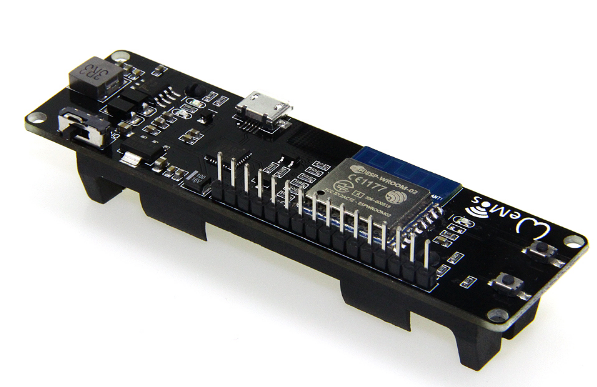

# batbaby WiFi Scan



Playing with the WeMos 8266 D1

```
$ stty -F /dev/ttyUSB0 115200 cs8 -cstopb -parenb -icanon min 1 time 1
$ while true; do cat -v < /dev/ttyUSB0 done
Scanning...
2 networks found :-)
1: Volumio (-67)  S
2: klipwerf 2.4 (-59)  S

Scanning...

2 networks found :-)
1: Volumio (-65)  S
2: klipwerf 2.4 (-60)  S

Scanning...

2 networks found :-)
1: Volumio (-65)  S
2: klipwerf 2.4 (-62)  S
```

# Resources

* https://www.aliexpress.com/store/product/Wemos-esp-wroom-02-Pocket-8266-D1-mini-WIFI-Module-ESP8266-18650-Battery/1983387_32810063490.html

